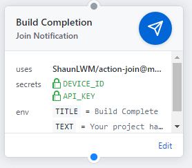

# Join Notifications for GitHub Actions



This action allows you to send yourself a push notification via [Join](https://play.google.com/store/apps/details?id=com.joaomgcd.join).

## Usage

To use the action simply add the following lines to your `.github/main.workflow` and provide the required Secrets and Environment variables.

```
action "Build Completion" {
  uses = "ShaunLWM/action-join@master"
  secrets = ["DEVICE_ID", "API_KEY"]
  env = {
    TITLE = "Build Complete"
    TEXT = "Your project has been built."
  }
}
```

### Secrets

You'll need to provide these secrets to use the action.

* **DEVICE_ID**: Select your device from [Join](https://joinjoaomgcd.appspot.com/) and copy the `Device Id` under `Join API`
* **API_KEY**: Similarly, in `Join API`, click `Show` at API Key section.

### Environment Variables

You'll need to provide these environment variables to specify exactly what information to send to your device.

* **TITLE**: The title of the notification.
* **TEXT**: The body of the notification.

[Learn more](https://joaoapps.com/join/api/) about the required parameters and the keys above.

## Credits

Based off [maddox/actions](https://github.com/maddox/actions/blob/master/pushover/entrypoint.sh)

## License

MIT 2019